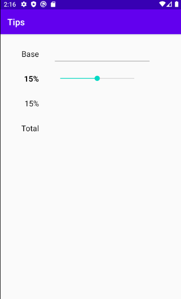
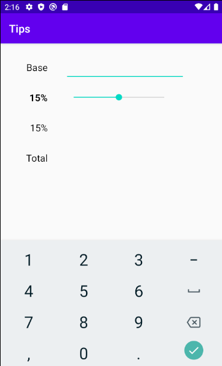
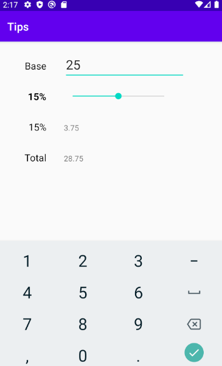
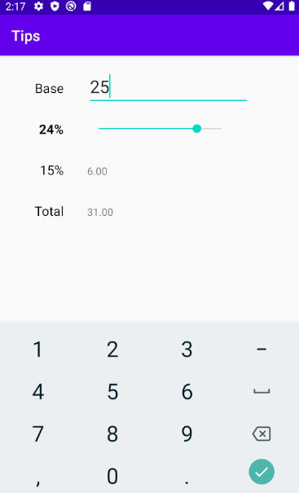

This app helps you calculate the total bill including the tips based on the percentage you set

When you open the app you can see the percentage is set to 15%.
Which also represents the middle value and a fair amount for the tip

You will have to enter the bill amount

After that the app makes the math for you

And you can chnage the percentage of the tip based on your experience between 1 and 30

